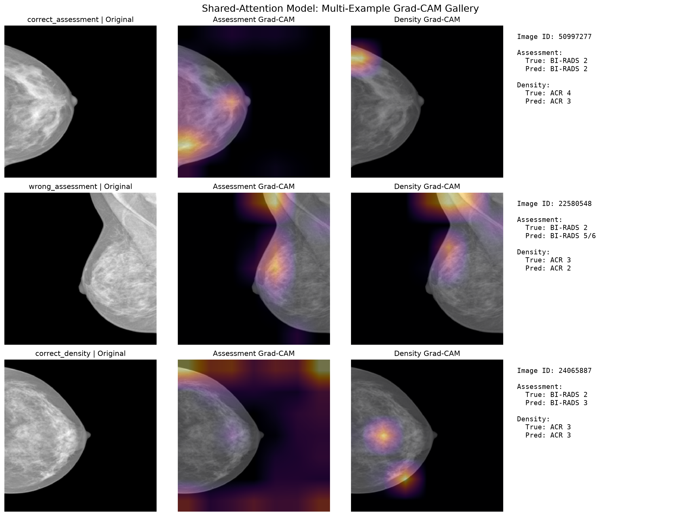
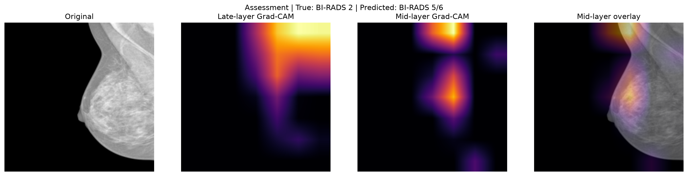
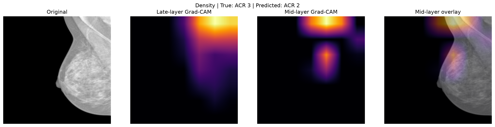

# Multi-Task Mammography Classification with Attention and Ordinal Assessment

A compact PyTorch research/engineering project for **joint BI-RADS assessment classification and breast-density classification** on the INbreast mammography dataset.

The project explores whether a shared visual representation can support two related mammography tasks, and compares a weighted categorical baseline, a cumulative-threshold assessment variant, a shared channel-spatial attention model, and a task-specific dual-attention model.

> **Scope:** this is an educational research project, not a clinical diagnostic system.  
> The main assessment target is derived from BI-RADS assessment categories and is **not biopsy-confirmed pathology ground truth**.

---

## 1. Motivation

Mammograms contain information relevant to several related radiological tasks. Rather than training a separate network for every label, multi-task learning can test whether a shared representation helps the model learn complementary visual structure.

This project was inspired by recent work on multi-task, attention-guided mammography models, but it is **not a reproduction of that paper**. The available dataset extract and metadata required a different, more conservative problem formulation.

The main questions explored here are:

- Can one EfficientNet-B0 backbone jointly predict **BI-RADS assessment** and **breast density**?
- Does class weighting reduce collapse toward the majority BI-RADS class?
- Does a cumulative-threshold formulation help an ordered assessment target?
- Does shared channel-spatial attention improve performance over a plain shared backbone?
- Does a more complex task-specific dual-attention design outperform shared attention?
- What regions influence the model's predictions according to Grad-CAM?

---

## 2. Dataset

The project uses **INbreast**, a full-field digital mammography dataset containing **410 mammograms from 115 cases**.

Reference:

> Moreira, I. C., Amaral, I., Domingues, I., Cardoso, A., Cardoso, M. J., & Cardoso, J. S.  
> *INbreast: Toward a Full-field Digital Mammographic Database.*  
> Academic Radiology, 19(2), 236–248, 2012.  
> DOI: https://doi.org/10.1016/j.acra.2011.09.014

The local PNG extract contains 410 images. A reproducibility audit verifies:

- 410 samples
- 410 unique image IDs
- 410 unique image paths
- one-to-one correspondence between PNG IDs and accessible metadata
- no duplicate IDs or paths
- no overlap between train, validation, and test image indices

Run the audit with:

```bash
python -m scripts.audit_data
```

---

## 3. Problem Reformulation

The reference work motivating this project uses binary pathology classification together with four-class density estimation. In the accessible metadata used here, however, the reliable labels available for the local images are BI-RADS assessment and ACR density.

A binary target derived from BI-RADS categories would not be equivalent to biopsy-confirmed malignancy. For that reason, the main task was reformulated rather than presented as "cancer detection."

### Task A — 5-class BI-RADS assessment

| Model class | Source BI-RADS |
|---:|---|
| 0 | BI-RADS 1 |
| 1 | BI-RADS 2 |
| 2 | BI-RADS 3 |
| 3 | BI-RADS 4a / 4b / 4c |
| 4 | BI-RADS 5 / 6 |

### Task B — 4-class breast density

| Model class | ACR density |
|---:|---|
| 0 | ACR 1 |
| 1 | ACR 2 |
| 2 | ACR 3 |
| 3 | ACR 4 |

One image has a missing density annotation. Its density target is encoded as `-1` and explicitly masked from density loss and density metrics.

---

## 4. Data Split

A fixed image-level split with seed `42` is used:

| Split | Images | Fraction |
|---|---:|---:|
| Train | 262 | 64% |
| Validation | 65 | 16% |
| Test | 83 | 20% |
| **Total** | **410** | **100%** |

The split is stratified by the 5-class assessment target.

### Important limitation: image-level rather than patient-level split

The accessible metadata used in this project does not provide a usable patient identifier for constructing a patient-grouped split. Therefore, the split is performed at the **image level**.

This means that the project **cannot guarantee patient-level independence** between train, validation, and test subsets. This limitation should be considered when interpreting all reported metrics.

---

## 5. Preprocessing

Mammograms are loaded as grayscale images and converted to three channels for ImageNet-pretrained backbones.

Training preprocessing:

- resize to `224 × 224`
- grayscale → 3 channels
- random horizontal flip (`p=0.5`)
- brightness jitter (`±10%`)
- contrast jitter (`±10%`)
- ImageNet normalization

Validation and test preprocessing are deterministic and do **not** use augmentation.

---

## 6. Models

All experiments use **EfficientNet-B0** with ImageNet initialization.

### 6.1 Weighted categorical baseline

A shared EfficientNet-B0 backbone feeds a shared 256-dimensional representation and two categorical heads:

```text
Mammogram
   │
EfficientNet-B0
   │
Shared FC representation
   ├── 5-class BI-RADS assessment
   └── 4-class density
```

Assessment class weights are derived from the training split to reduce majority-class collapse.

### 6.2 Cumulative-threshold assessment variant

The assessment task is replaced by four cumulative binary thresholds for five ordered classes:

```text
class 0 → [0, 0, 0, 0]
class 1 → [1, 0, 0, 0]
class 2 → [1, 1, 0, 0]
class 3 → [1, 1, 1, 0]
class 4 → [1, 1, 1, 1]
```

The density task remains a standard 4-class categorical head.

This variant is best described as **cumulative-threshold / ordinal-inspired**, because the four threshold outputs are optimized independently and strict monotonicity is not structurally enforced.

### 6.3 Shared channel-spatial attention

A CBAM-like channel-spatial attention module is placed after the EfficientNet feature extractor and before global pooling:

```text
EfficientNet features
        │
Channel attention
        │
Spatial attention
        │
Global average pooling
        │
Shared representation
     ┌──┴──┐
Assessment Density
```

The same attended representation is used by both tasks.

### 6.4 Task-specific dual-attention model

The dual-attention model branches after the shared EfficientNet feature extractor:

```text
                     ┌─ Assessment attention ─ FC ─ Assessment head
EfficientNet features
                     └─ Density attention ───── FC ─ Density head
```

This changes both the attention pathway **and** the post-pooling task representation, so it should be interpreted as a more complex **task-specific dual-branch architecture**, not as an isolated test of "two attention blocks."

---

## 7. Training

Training uses two stages:

### Stage 1 — frozen backbone

- train attention / shared layers / task heads
- AdamW
- learning rate: `1e-4`
- weight decay: `1e-2`

### Stage 2 — full fine-tuning

- unfreeze the backbone
- AdamW
- learning rate: `5e-5`
- weight decay: `5e-3`

Additional settings:

- batch size: `16`
- image size: `224`
- gradient clipping: norm `1.0`
- assessment and density task weights: `1.0 / 1.0`
- label smoothing: `0.05`
- model selection: mean of validation assessment macro-F1 and density macro-F1

The best validation checkpoint is restored before test evaluation.

---

## 8. Evaluation

Primary metrics:

### Assessment

- Accuracy
- Balanced Accuracy
- Macro-F1
- Mean Absolute Error (MAE)

MAE is useful because the assessment classes are ordered: confusing BI-RADS 1 with BI-RADS 2 is less distant than confusing BI-RADS 1 with BI-RADS 5/6.

### Density

- Accuracy
- Balanced Accuracy
- Macro-F1

Class-wise F1 scores and confusion matrices are also available in the evaluation code.

---

## 9. Results

All models below were evaluated on the same fixed 83-image test split.

| Model | Assessment Acc. | Assessment Bal. Acc. | Assessment Macro-F1 | Assessment MAE ↓ | Density Acc. | Density Bal. Acc. | Density Macro-F1 |
|---|---:|---:|---:|---:|---:|---:|---:|
| Weighted categorical baseline | 0.265 | 0.237 | 0.209 | 1.506 | 0.518 | 0.401 | 0.373 |
| Cumulative-threshold assessment | 0.253 | 0.274 | 0.193 | 1.229 | **0.639** | **0.513** | **0.488** |
| **Shared attention** | **0.470** | **0.279** | **0.256** | **1.133** | 0.494 | 0.384 | 0.347 |
| Dual attention | 0.386 | 0.249 | 0.237 | 1.253 | 0.482 | 0.367 | 0.329 |

The source CSV is stored at:

```text
results/tables/model_comparison.csv
```

### Interpretation

**Shared attention produced the strongest assessment results.**  
It achieved the highest assessment accuracy, balanced accuracy, and macro-F1, and the lowest assessment MAE.

**The cumulative-threshold variant produced the strongest density results.**  
However, density itself remained a standard categorical head. Therefore, the density improvement should **not** be interpreted as evidence that an ordinal density formulation was superior.

**Dual attention increased model complexity without outperforming shared attention.**  
The more separated task-specific design did not provide a clear benefit on this small dataset.

**Class weighting improved the flat assessment formulation.**  
This was introduced to reduce collapse toward the dominant assessment class in the training set.

---

## 10. Cumulative-Threshold Consistency Audit

The cumulative-threshold assessment head does not enforce monotonic outputs by construction.

A post-hoc audit found non-monotonic threshold patterns in:

- **15 / 65 validation images (23.1%)**
- **22 / 83 test images (26.5%)**

For example, an output pattern such as `[1, 0, 1, 0]` is inconsistent with a strictly ordered cumulative model.

Predictions in the current experiment are decoded by counting thresholds whose sigmoid probability exceeds `0.5`.

Because the issue was identified after the main experiment, the decoder was **not changed post-hoc using test-set behavior**. The result is kept as a methodological limitation rather than retroactively optimizing the evaluation pipeline.

---

## 11. Grad-CAM Analysis

Grad-CAM was implemented for the shared-attention model to inspect gradient-based saliency for both task heads.

Importantly, these maps are:

- **not** the learned attention weights themselves
- **not** lesion segmentations
- **not** evidence of clinical validity

They are qualitative saliency visualizations showing which intermediate backbone regions influenced a selected prediction.

### Multi-example gallery



The gallery includes selected correct and incorrect predictions for qualitative inspection.

### Mid-layer vs. late-layer comparison

Assessment:



Density:



In the inspected examples, the intermediate backbone layer produced more spatially localized maps than the final backbone representation. Saliency was often concentrated within breast tissue rather than empty background, but this observation is qualitative and based on selected examples.

---

## 12. Technical Audit

Before finalizing the repository, the pipeline was audited for common experimental and implementation errors.

Checks included:

- PNG ↔ metadata one-to-one correspondence
- duplicate image IDs and paths
- target encoding
- train / validation / test overlap
- assessment stratification
- preprocessing leakage
- missing density masking
- class-weight calculations
- categorical logits / loss consistency
- cumulative-threshold target construction
- threshold positive weights
- checkpoint selection
- test-time metric calculation
- Grad-CAM checkpoint identity
- ordinal threshold consistency
- stale clinical / pathology terminology

### Audit outcome

No critical implementation error requiring full retraining was identified.

The main remaining issues are methodological limitations rather than hidden code failures.

---

## 13. Limitations

This project should be interpreted as a small-scale ML/CV research and engineering study.

### Dataset size

INbreast contains only 410 mammograms. Rare assessment and density classes have limited representation.

### Image-level split

Patient identifiers were not available in the accessible metadata used here, so a patient-level split could not be constructed. Potential same-patient correlation across subsets cannot be excluded.

### Single primary split and seed

The reported comparison is based on one fixed stratified split with seed `42`. Multi-seed evaluation or patient-grouped cross-validation would provide stronger estimates of robustness.

### Repeated use of the same hold-out during model development

The same fixed test split was used to compare several architecture iterations during development. The test set was not used for gradient updates or checkpoint selection, but repeated inspection means it should not be treated as a perfectly untouched final benchmark.

### Modest BI-RADS assessment performance

Assessment macro-F1 remains low across all variants. The results are useful for comparing design choices within this project, but they do not support claims of deployment-level performance.

### Cumulative-threshold monotonicity

The ordinal-inspired assessment model does not enforce monotonic threshold outputs; approximately one quarter of validation and test predictions violated monotonicity.

### Grad-CAM is qualitative

Grad-CAM is a saliency proxy. It does not establish lesion localization accuracy, causal reasoning, or agreement with radiologist attention.

---

## 14. Reproducibility

Install dependencies:

```bash
pip install -r requirements.txt
```

Run the data-integrity audit:

```bash
python -m scripts.audit_data
```

Training entry points:

```bash
python -m src.training.train
python -m src.training.train_ordinal
python -m src.training.train_attention
python -m src.training.train_dual_attention
```

Evaluate saved experiments:

```bash
python -m src.evaluation.compare_models
```

Generate Grad-CAM analyses:

```bash
python -m src.evaluation.gradcam
python -m src.evaluation.gradcam_gallery
```

Model checkpoints and the INbreast dataset are intentionally excluded from version control.

---

## 15. Repository Structure

```text
mammography-multitask-ai/
├── configs/
│   └── baseline.yaml
├── data/
│   └── README.md
├── experiments/
│   └── README.md
├── results/
│   ├── figures/
│   │   ├── 22580548_assessment_gradcam_comparison.png
│   │   ├── 22580548_density_gradcam_comparison.png
│   │   └── gradcam_gallery_shared_attention.png
│   └── tables/
│       └── model_comparison.csv
├── scripts/
│   └── audit_data.py
├── src/
│   ├── data/
│   │   ├── dataset.py
│   │   ├── loaders.py
│   │   ├── preprocessing.py
│   │   └── splits.py
│   ├── evaluation/
│   │   ├── compare_models.py
│   │   ├── gradcam.py
│   │   ├── gradcam_gallery.py
│   │   ├── metrics.py
│   │   └── ordinal_metrics.py
│   ├── models/
│   │   ├── attention.py
│   │   ├── multitask_attention.py
│   │   ├── multitask_baseline.py
│   │   ├── multitask_dual_attention.py
│   │   └── multitask_ordinal.py
│   └── training/
│       ├── losses.py
│       ├── ordinal_losses.py
│       ├── train.py
│       ├── train_attention.py
│       ├── train_dual_attention.py
│       └── train_ordinal.py
├── .gitignore
├── README.md
└── requirements.txt
```

---

## 16. Relation to the Reference Paper

The project was motivated by:

> Esen, G., Nurtas, M., La Paglia, L., Amankulov, J., Matkerim, B., & Altaibek, A.  
> *Multi-Task Attention-Guided Deep Learning for Simultaneous Breast Cancer Detection and Density Estimation in Mammography.*  
> IEEE Access, 2025.  
> DOI: https://doi.org/10.1109/ACCESS.2025.3634473

That work combines binary malignancy/pathology classification with breast-density estimation and attention-guided CNNs.

This repository intentionally differs in several ways:

- the main target is **5-class BI-RADS assessment**, not binary malignancy
- EfficientNet-B0 is used as the common backbone for controlled comparisons
- the project compares categorical, cumulative-threshold, shared-attention, and dual-branch variants
- Grad-CAM is used as a qualitative saliency tool
- claims are limited to what the accessible labels and experimental protocol support

The goal is not to reproduce the paper's reported clinical metrics, but to use its multi-task and attention ideas as a starting point for a technically auditable student research project.

---

## 17. Future Work

The most meaningful next steps would be:

- obtain reliable patient identifiers and repeat evaluation with a patient-grouped split
- use multi-seed or patient-grouped cross-validation
- evaluate larger mammography datasets
- test a strictly monotonic ordinal formulation
- quantify uncertainty and calibration
- evaluate Grad-CAM against expert lesion annotations rather than visual inspection alone
- separate architecture selection from a genuinely untouched final test set

---

## Disclaimer

This repository is for **educational and research purposes only**.

It is not a medical device, has not undergone clinical validation, and should not be used for diagnosis, screening, treatment decisions, or patient care.
