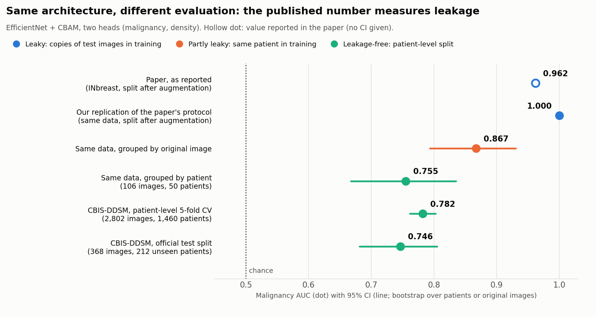
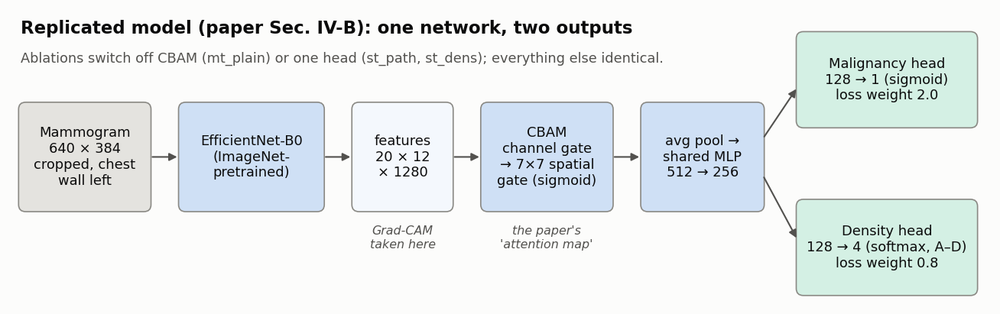

# Multi-Task Mammography AI: a replication study

**I rebuilt a published breast-cancer AI model, showed that its 93.6% headline accuracy comes from data leakage,
and measured what the same design really achieves.**

   

[**Technical report (PDF)**](report/report.pdf) · [**Live demo**](https://mammography-multitask-ai.streamlit.app) · [**Model card**](MODEL_CARD.md) ·
[Detailed results](docs/RESULTS.md) · [Paper audit](PAPER_AUDIT.md)

> ⚠️ Research and education only. Not a medical device. Must not be used for diagnosis or screening.

---



[Esen et al., IEEE Access 2025](https://doi.org/10.1109/ACCESS.2025.3634473) propose one neural network that reads a
mammogram and does two jobs at once: it says whether a finding is **malignant**, and it grades **breast density**
(A–D). They report 93.6% accuracy and AUC 0.962. My first attempt to reproduce it reached 34–53% accuracy. Instead of
tuning until the numbers looked good, I audited the paper's evaluation, then tested every claim I could with code.

## Findings

1. **The published accuracy is a data-leakage artefact.** The images were rotated and flipped into ~72 copies each
   *before* being split into training and test sets, so the test set was full of copies of training images. Running
   that protocol on the same data, my replication scores a perfect AUC **1.000**. Splitting so that no patient appears
   on both sides gives **0.755**, and on 50 patients the model's density "skill" falls to chance level.
   → [Phase 2](docs/RESULTS.md#phase-2-the-leakage-experiment-huang--lin--inbreast-masses)
2. **With an honest split, the design works but isn't special.** On CBIS-DDSM (2,802 mammograms, 1,460 patients,
   biopsy-confirmed labels), the paper's architecture reaches malignancy AUC **0.782** (95% CI 0.762–0.802) in
   patient-level cross-validation and **0.746** on the official test split, plus density agreement QWK **0.77**.
   Doing both tasks in one network does not measurably help either task; the attention module adds a small
   +0.013 AUC (one seed). → [Phase 3](docs/RESULTS.md#phase-3-a-leakage-free-multi-task-model-cbis-ddsm)
3. **Density grading transfers to another country and technology; probabilities don't.** Trained only on scanned
   1990s film from the US, the model grades digital mammograms from Portugal (INbreast) with QWK **0.66**, 93% within one
   grade of the radiologist. Its probabilities, however, need recalibration for each new setting.
   → [Phase 4](docs/RESULTS.md#phase-4-can-the-probabilities-be-trusted-and-does-the-model-travel)
4. **The "attention maps" don't point at lesions.** Scored against 376 radiologist-drawn lesion outlines, the
   paper-style attention map lands on the lesion in 24% of images, about as often as a map that simply highlights
   the brightest tissue (18%). Grad-CAM of the *same* model does localise (44%, 5.7× chance). None of the paper's
   attention statistics could be reproduced.
   → [Phase 5](docs/RESULTS.md#phase-5-do-the-attention-maps-point-at-the-lesion)

The paper also contains internal inconsistencies that can be checked without any code. For example, its Brier score
and calibration error are mathematically incompatible (Brier ≥ ECE² always holds), and Table 1 does not add up. The full
list, each point tied to a section, table or figure of the paper: [PAPER_AUDIT.md](PAPER_AUDIT.md).

## Main results

All numbers are for the paper's design (EfficientNet-B0 + CBAM, two heads), evaluated with no patient in both
training and test. 95% CIs come from a bootstrap over patients.

| Test | Malignancy AUC | Density | Majority-class baseline |
|---|---:|---:|---|
| CBIS-DDSM, 5-fold CV (2,802 images / 1,460 patients) | **0.782** (0.762–0.802) | QWK **0.769** (0.746–0.791), acc. 0.668 | acc. 0.552 / 0.395 |
| CBIS-DDSM, official test (368 / 212) | **0.746** (0.681–0.805) | QWK **0.711** (0.631–0.773), acc. 0.606 | acc. 0.579 / 0.454 |
| INbreast, external (410 / 108), never used in training | 0.822* (0.761–0.877) | QWK **0.660** (0.550–0.743), acc. 0.538 | – / acc. 0.357 |
| *Paper, as reported (leaky protocol)* | *0.962* | *acc. 0.889* | |

\* Proxy target: suspicious (BI-RADS 4–6) vs not (1–3). INbreast has no biopsy result for most images, and it
includes normal mammograms, which makes this an easier task than CBIS-DDSM.

Also measured: calibration (the raw malignancy output is over-confident and biased; Platt scaling cuts the
calibration error from 0.109 to 0.028), operating points (a threshold set for 90% sensitivity leaves 39% specificity), and subgroups
(masses AUC 0.83 vs calcifications 0.72, because calcifications are only a few pixels across at 640×384).

## How the study was done



- **Leakage-safe by construction.** Every split is by patient and is checked by an assertion in every fold. Images
  stored twice in CBIS-DDSM are merged, and 22 patients who appear in both official CBIS-DDSM splits are counted as
  training patients. Unit tests check that splits never leak.
- **Ablations, not one model.** Four variants share the same folds: the paper design, without attention,
  malignancy-only and density-only. Differences are measured by *paired* bootstraps on the same test images.
- **Baselines everywhere.** Majority class for accuracy; for attention, maps that know nothing about lesions
  (uniform, random, brightest tissue, breast centre, and an untrained network).
- **No tuning on test data.** Fixed schedules, no early stopping on the test fold, and calibration is cross-fitted.
  Random, not hand-picked, examples in every gallery.
- **Reproducible.** Retraining with the same seed reproduced the official-split numbers to three decimals. Every
  experiment is one command and one free Kaggle notebook.

## Limitations

- **One seed per model.** Small effects (such as CBAM's +0.013 AUC) need more seeds to be trusted.
- **Different backbone and resolution from the paper.** I used EfficientNet-B0 at 640×384 instead of B3 at 300×300 or 224×224; the paper states both.
  I built the CBAM version of the paper's two differing attention descriptions.
- **Whole-image classification of *findings*.** CBIS-DDSM contains only mammograms with a lesion, so this is not a
  screening model: it has never been tested on a screening population.
- **Small external test.** INbreast has 108 patients, and malignancy there is a BI-RADS proxy, not biopsy-proven.

## Demo

[Try the model in a browser](https://mammography-multitask-ai.streamlit.app): upload a mammogram and get the malignancy score (calibrated on
CBIS-DDSM), the density grade, Grad-CAM, and the attention gate on its true 0–1 scale. The examples are six
randomly drawn official-test images (seed 0, three malignant and three benign), misclassified ones included; the app
reproduces their Phase 5 predictions exactly. It runs on the free Streamlit Community Cloud and falls asleep when
unused, so the first visit can take about a minute. Code: [`demo/streamlit_app.py`](demo/streamlit_app.py),
[`src/mammo/demo.py`](src/mammo/demo.py). Check of the demo against Phase 5: [`results/demo/`](results/demo/).

## Repository layout

```
src/mammo/            data indexing, leakage-safe splits, preprocessing, model, training, metrics,
                      calibration, localisation, plots, demo inference
  experiments/        one script per experiment (python -m mammo.experiments.<name>)
notebooks/            thin Kaggle notebooks that call the scripts (02-06)
tests/                unit tests: splits never leak, label merging, preprocessing geometry, metrics, demo
results/              every number and figure in this README, as committed JSON / CSV / PNG
docs/RESULTS.md       full tables and discussion, phase by phase
report/               technical report (LaTeX source + PDF)
MODEL_CARD.md         intended use, data, performance, limitations of the released model
PAPER_AUDIT.md        section-by-section replication notes on the reference paper
archive/v1/           first attempt (kept for transparency)
```

## Reproduce

All experiments run on a free Kaggle GPU. Open a notebook on Kaggle, attach the inputs listed in its first cell,
turn on the GPU and Internet, then click **Run All**.

| Step | Notebook / command | Time |
|---|---|---|
| Phase 2: leakage | [`02_leakage_experiment.ipynb`](notebooks/02_leakage_experiment.ipynb) | ~40 min |
| Phase 3: CBIS-DDSM ablation | [`03_cbis_multitask.ipynb`](notebooks/03_cbis_multitask.ipynb) | ~2 h on T4 x2 |
| Phase 4a: calibration | `PYTHONPATH=src python -m mammo.experiments.calibration` | 1 min, laptop |
| Phase 4b: INbreast | [`04_external_inbreast.ipynb`](notebooks/04_external_inbreast.ipynb) | ~45 min on T4 x2 |
| Phase 5: attention | [`05_attention.ipynb`](notebooks/05_attention.ipynb) | ~15 min on one T4 |
| Overview figures | `PYTHONPATH=src python -m mammo.experiments.overview` | 10 s, laptop |
| Demo | [`06_demo_export.ipynb`](notebooks/06_demo_export.ipynb) | ~10 min, CPU |

Locally: `pip install -r requirements.txt && PYTHONPATH=src pytest -q tests`

## Data

- **CBIS-DDSM**: Lee et al., *Scientific Data* 4:170177, 2017 (TCIA, CC BY 3.0). I used the JPEG release on Kaggle,
  [awsaf49/cbis-ddsm-breast-cancer-image-dataset](https://www.kaggle.com/datasets/awsaf49/cbis-ddsm-breast-cancer-image-dataset).
- **INbreast**: Moreira et al., *Academic Radiology* 19(2):236–248, 2012.
- **Huang & Lin (2020)**, *Dataset of breast mammography images with masses*, Data in Brief 31:105928 (CC BY-NC-SA
  4.0): the pre-augmented INbreast mass images used for the leakage experiment.

Apart from six CBIS-DDSM test images used as demo examples ([`demo/examples/`](demo/examples/), CC BY 3.0, with
attribution), no images are redistributed in this repository.

## About this project

**Amangeldiuly Arslan.** This is an independent project, not affiliated with the paper's authors. I directed the study, ran every
experiment and reviewed the results. The code and much of the analysis were produced with an AI assistant
(Claude, Anthropic), which is why many commits are authored by "Claude". Critique of the reference paper is meant
as a good-faith replication, and I am happy to correct anything I got wrong. Please open an issue.
