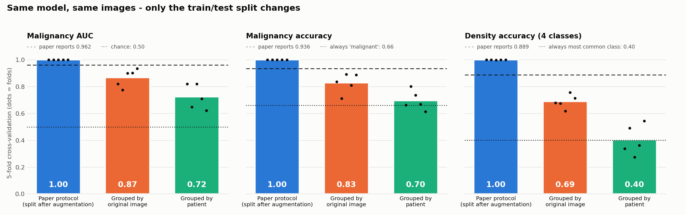
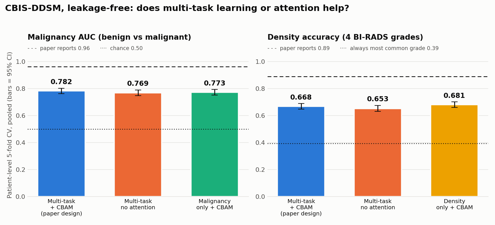
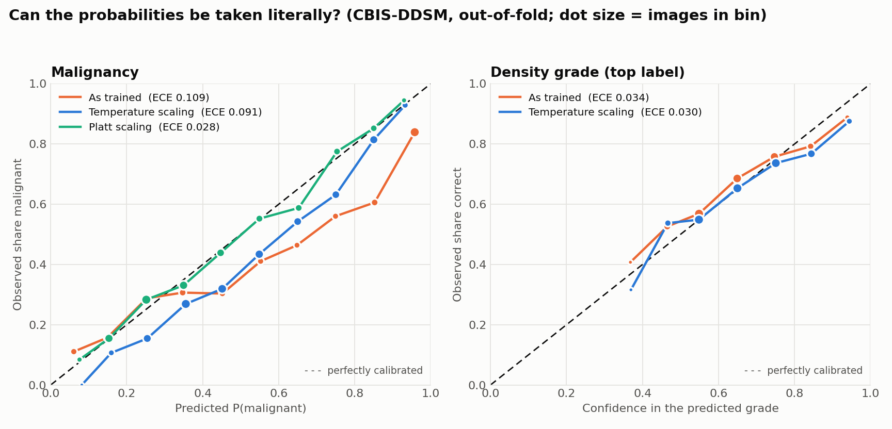

# Multi-Task Mammography AI: a replication study

**Joint malignancy and breast-density classification, and why a published 93.6% turned out to be data leakage.**

   

> ⚠️ Research and education only. Not a medical device. Must not be used for diagnosis or screening.

---

## TL;DR

I set out to reproduce [Esen et al., IEEE Access 2025](https://doi.org/10.1109/ACCESS.2025.3634473), a multi-task
CNN with channel–spatial attention that reports **93.6% accuracy / 0.962 AUC** for benign-vs-malignant
classification on INbreast. My first attempt ([`archive/v1`](archive/v1)) reached only 34–53% accuracy. Instead of
tuning until the numbers looked good, I audited the paper:

1. **The data was augmented before it was split.** Rotated copies of the same mammogram ended up in both the
   training and test sets ([details](PAPER_AUDIT.md#1-main-issue-the-test-set-contains-copies-of-training-images)).
2. **The reported accuracies are arithmetically impossible** on a 20% split of 410 images, and only possible on
   the augmented copies ([§2](PAPER_AUDIT.md#2-the-reported-accuracies-imply-an-augmented-test-set)).
3. **The reported Brier score and ECE contradict each other.** Brier ≥ ECE² always holds; the paper's values
   violate it ([§4.2](PAPER_AUDIT.md#4-internal-inconsistencies)).

Then I **tested it**: the same model, trained on the same images, with only the split changed.

<!-- RESULTS:LEAKAGE -->


EfficientNet-B0 with CBAM attention and two task heads, following the paper's architecture, loss weights and label
smoothing. The data is the pre-augmented set the paper appears to use: 106 INbreast mass images × 72 copies =
7,632 files from 50 patients. The model and training are identical in all three runs; 5-fold CV; 8 epochs; one
free Kaggle T4.

| Split | Test files whose original is in train | Malignancy AUC | Malignancy acc. | Density acc. |
|---|---:|---:|---:|---:|
| Paper protocol (augment, then split) | **100%** | **1.000** ± 0.000 | **1.000** | **1.000** |
| Grouped by original image | 0% | 0.867 ± 0.066 | 0.828 | 0.689 |
| Grouped by patient | 0% | **0.724** ± 0.093 | **0.697** | **0.403** |
| *Trivial baseline (always predict the most common class)* | | *0.500* | *0.66* | *0.40* |

Pooled out-of-fold AUC for the patient-grouped split: **0.755** (95% CI 0.667–0.835, cluster bootstrap over
original images).

**What this shows**

1. **The paper's protocol produces near-perfect scores regardless of what the model learns.** On average ~57 of each test image's 71 rotated or flipped siblings are in the training set.
   Our replication scores *higher* than the paper (1.000 vs 0.962): the protocol measures memorisation.
2. **Grouping by image is not enough.** With image-level grouping, 97% of test images still had a
   *different mammogram of the same patient* in training. Separating patients drops malignancy AUC from 0.87 to 0.72.
3. **The density "skill" disappears completely.** With a patient-level split, density accuracy (0.403) equals always
   guessing the most common category (0.401). The model had learned to recognise *patients*, not breast density.
   That is unsurprising for 50 patients, and it matters for any multi-task claim made on this data.
4. **Honest numbers on 106 images are uncertain.** Fold-to-fold AUC ranges from 0.62 to 0.82. Phase 3 therefore moves
   to CBIS-DDSM (~1,500 patients, biopsy-confirmed labels) for the model-building work.

## Phase 3: a leakage-free multi-task model (CBIS-DDSM)

Phase 2 showed that on ~106 images honest numbers are too uncertain to compare designs. Phase 3 moves to
**CBIS-DDSM**: about 3,100 mammograms from about 1,500 patients, with **biopsy-confirmed** pathology, a BI-RADS density
grade and a patient ID for every image. The question is no longer "can we hit 93%?" but **"once the split is
honest, does the paper's design actually help?"**

| Variant | Malignancy head | Density head | CBAM attention | Answers |
|---|:-:|:-:|:-:|---|
| `mt_cbam` | ✓ | ✓ | ✓ | the paper's design |
| `mt_plain` | ✓ | ✓ | – | does attention help? |
| `st_path` | ✓ | – | ✓ | does learning density help malignancy? |
| `st_dens` | – | ✓ | ✓ | does learning malignancy help density? |

**Design choices that keep the evaluation honest**

- **Patient-level 5-fold CV.** No patient ever appears in both train and test (checked by an assertion in
  every fold). All four variants share the same folds, so they can be compared image by image.
- **One image = one example.** CBIS-DDSM stores a mammogram twice when it has both a mass and a calcification;
  these copies are merged so the same film can't end up on both sides of a split.
- **No tuning on the test fold.** A fixed schedule of 15 epochs, with no early stopping and no threshold picked on test data.
- **Uncertainty reported.** 95% CIs come from a bootstrap over *patients*. Variant-vs-variant differences use a
  *paired* bootstrap on the same test images.
- **Standard benchmark too.** The main model is also trained on the official CBIS-DDSM training split and tested
  on the official test split. Patients who appear in both are counted as training patients.
- **Whole mammograms, not lesion crops.** Each image is cropped to the breast, oriented chest-wall-left and
  resized to 640×384. Malignancy is therefore predicted from the whole image, which is harder (and more
  realistic) than classifying a radiologist-drawn crop.

<!-- RESULTS:CBIS -->


2,802 mammograms from 1,460 patients. Patient-level 5-fold CV, pooled out-of-fold, with 95% CIs from a bootstrap
over patients. EfficientNet-B0 at 640×384, 15 epochs, 2× Kaggle T4, about 1.5 h for all 20 models.

| Model | Malignancy AUC (95% CI) | Malignancy acc. | Density acc. | Density QWK (95% CI) |
|---|---:|---:|---:|---:|
| **Multi-task + CBAM (paper design)** | **0.782** (0.762–0.802) | 0.700 | 0.668 | 0.769 (0.746–0.791) |
| Multi-task, no attention | 0.769 (0.748–0.789) | 0.697 | 0.653 | 0.761 (0.735–0.784) |
| Malignancy only + CBAM | 0.773 (0.752–0.793) | 0.691 | – | – |
| Density only + CBAM | – | – | 0.681 | 0.780 (0.755–0.802) |
| *Always predict the most common class* | *0.500* | *0.552* | *0.395* | *0.000* |

QWK is the quadratic-weighted kappa: agreement on the ordered density grades A < B < C < D, where 0 means chance.

**Official CBIS-DDSM test split** (paper design, trained on the official training patients): malignancy AUC
**0.746**, density accuracy 0.606, QWK 0.711, on 368 images from 212 patients never seen in training. 22 patients
appear in *both* the official train and test files. We count them as training patients, so the official split
leaks too unless it is re-checked at the patient level.

**Does the paper's design help?** Each comparison is paired (same test images, bootstrap over patients):

| Question | Difference | 95% CI | Verdict |
|---|---:|---:|---|
| Does adding density help malignancy? | AUC +0.009 | −0.004 to +0.024 | no clear effect |
| Does adding malignancy help density? | QWK −0.010 | −0.026 to +0.005 | no clear effect |
| Does CBAM attention help malignancy? | AUC +0.013 | +0.002 to +0.026 | small gain (single seed) |
| Does CBAM attention help density? | QWK +0.008 | −0.005 to +0.023 | no clear effect |

**What this shows**

1. **With an honest split, the paper's architecture reaches AUC 0.78, not 0.96.** That is a solid, realistic
   number for classifying whole downsampled mammograms, and it falls within the 0.70–0.85 range expected from the
   Phase 2 audit. The gap to the reported 93.6% accuracy comes from the evaluation protocol, not from the architecture.
2. **Multi-task learning neither helps nor hurts measurably.** One network doing both tasks matches two separate
   networks, so its practical value is efficiency (one model instead of two), not accuracy.
3. **CBAM attention gives a small malignancy gain (+0.013 AUC).** It is statistically detectable across patients,
   but it comes from a single training seed and is small next to the fold-to-fold spread (±0.025). Whether the
   attention maps actually point at lesions is tested in Phase 5.
4. **Density is learnable on this data.** QWK is 0.77, and most errors are between neighbouring grades. On the 50
   patients of Phase 2, density was at chance.
5. **Calcifications are the hard case.** AUC is 0.83 on images with masses but 0.72 on images with only
   calcifications. Calcifications are a few pixels across and largely lost at 640×384.

## Phase 4: can the probabilities be trusted, and does the model travel?

A model can rank cases well and still give misleading probabilities. If it says "80% malignant", about 80% of those
cases should actually be malignant. Phase 4 checks this (**calibration**) and then tests the model on a dataset from
a different country and imaging technology (**external validation**).

### 4a. Calibration (CBIS-DDSM, no retraining)

This part uses the out-of-fold predictions saved in Phase 3, so it needs no GPU
(`PYTHONPATH=src python -m mammo.experiments.calibration`). Every calibration is **cross-fitted**: fold *k* is
calibrated with parameters learned on the other four folds, so no image's own label is ever used to calibrate it.

<!-- RESULTS:CALIBRATION -->


| Malignancy, paper design | ECE ↓ (95% CI) | Brier ↓ | Log loss ↓ | Mean predicted P(malignant) |
|---|---:|---:|---:|---:|
| As trained | 0.109 (0.095–0.131) | 0.205 | 0.610 | 0.542 |
| Temperature scaling (T ≈ 1.74) | 0.091 (0.072–0.112) | 0.197 | 0.576 | 0.539 |
| **Platt scaling** | **0.028** (0.024–0.049) | **0.188** | **0.555** | **0.448** |
| *Actual share of malignant images* | | | | *0.448* |

ECE (expected calibration error) is the average gap between predicted and observed frequency; 0 means perfect.
Bootstrapped ECE is biased slightly upwards, so its CI sits mostly above the point estimate.
Full tables for all variants: [`results/calibration/summary.md`](results/calibration/summary.md).

**What this shows**

1. **The malignancy output is over-confident *and* biased.** Its probabilities are too extreme (a temperature
   of 1.74 is needed to soften them), and on average it predicts 54% malignant when the true share is 45%. Temperature
   scaling can only fix the first problem. Platt scaling (a slope *and* an intercept) fixes both and cuts ECE from
   0.109 to 0.028. Neither changes the AUC, because both keep the ranking of the images the same.
2. **The density output is already well calibrated** (top-label ECE 0.034; temperature 0.88 barely changes it).
   The label smoothing used for the density head, which follows the paper, is probably part of the reason.
3. **A calibration only holds for the model it was fitted on.** Parameters learned from the cross-validation
   models and applied to the separately trained official-split model reduce its ECE from 0.206 to 0.090,
   not to 0.03. A deployed model has to be recalibrated on held-out data of its own.
4. **The threshold decides the trade-off, and the loss weights don't.** A threshold chosen on the other folds to
   reach 90% sensitivity does reach 89.8% on unseen patients, and it costs specificity (0.39, i.e. 950 false
   alarms among 1,547 benign images). The paper says its loss weighting (λ₁/λ₂ ≈ 2.5) "ensures minimizing false
   negatives". A loss weight does not set that trade-off; the decision threshold does.
5. **Sanity check against the paper.** For every model here Brier ≥ ECE², as it must be mathematically. The
   paper's pair (Brier 0.010, ECE 0.365–0.419) would need Brier ≥ 0.133.

### 4b. External validation on INbreast

The four variants are retrained on the official CBIS-DDSM training patients and tested, unchanged, on all 410
INbreast images: digital mammograms from Portugal, compared with scanned US film in training. Nothing from INbreast is used for
training, tuning or calibration. Density is the main test because both datasets grade it on the same 4-level
scale. Malignancy can only be checked against a proxy (BI-RADS 4–6 vs 1–3), since INbreast has no biopsy result
for most images.

<!-- RESULTS:EXTERNAL -->
*Pending:* run [`notebooks/04_external_inbreast.ipynb`](notebooks/04_external_inbreast.ipynb) on Kaggle (~45 min).

## Roadmap

| Phase | Status | What |
|---|---|---|
| 1 | ✅ | Clean, tested codebase (`src/mammo`), v1 archived |
| 2 | ✅ | **Leakage experiment**: paper protocol vs. image-grouped vs. patient-grouped CV |
| 3 | ✅ | Leakage-free multi-task model on CBIS-DDSM (biopsy-confirmed labels, patient-level split); single- vs. multi-task and attention ablations |
| 4 | 🟡 | Calibration ✅ (temperature and Platt scaling, operating points); external validation on INbreast ⏳ |
| 5 | ⏳ | Do attention maps point at lesions? Scored against radiologist ROI outlines |
| 6 | ⏳ | Final report |

## Repository layout

```
src/mammo/            data indexing, leakage-safe splits, model, training, metrics, plots
  experiments/        one script per experiment (python -m mammo.experiments.<name>)
notebooks/            thin Kaggle notebooks that call the scripts
tests/                unit tests (splits never leak, CBIS-DDSM label merging, preprocessing, metrics)
PAPER_AUDIT.md        section-by-section replication notes on the reference paper
archive/v1/           first attempt (kept for transparency)
```

## Reproduce

All experiments run on a free Kaggle GPU. Open the notebook on Kaggle, attach the datasets listed in its first
cell, turn on GPU and Internet, then **Run All**:

- [`notebooks/02_leakage_experiment.ipynb`](notebooks/02_leakage_experiment.ipynb): Phase 2, ~40 min
- [`notebooks/03_cbis_multitask.ipynb`](notebooks/03_cbis_multitask.ipynb): Phase 3, ~2 h on T4 x2
- `PYTHONPATH=src python -m mammo.experiments.calibration`: Phase 4a, 1 min on a laptop (uses the Phase 3 predictions)
- [`notebooks/04_external_inbreast.ipynb`](notebooks/04_external_inbreast.ipynb): Phase 4b, ~45 min on T4 x2

Locally: `pip install -r requirements.txt && PYTHONPATH=src pytest -q tests`

## Data

- **Huang & Lin (2020)**, *Dataset of breast mammography images with masses*, Data in Brief 31:105928 (CC BY-NC-SA 4.0). This is the pre-augmented INbreast mass images.
- **INbreast**: Moreira et al., *Academic Radiology* 19(2):236–248, 2012.
- **CBIS-DDSM**: Lee et al., *Scientific Data* 4:170177, 2017. We use the JPEG version on Kaggle
  ([awsaf49/cbis-ddsm-breast-cancer-image-dataset](https://www.kaggle.com/datasets/awsaf49/cbis-ddsm-breast-cancer-image-dataset)).

No images are redistributed in this repository.
